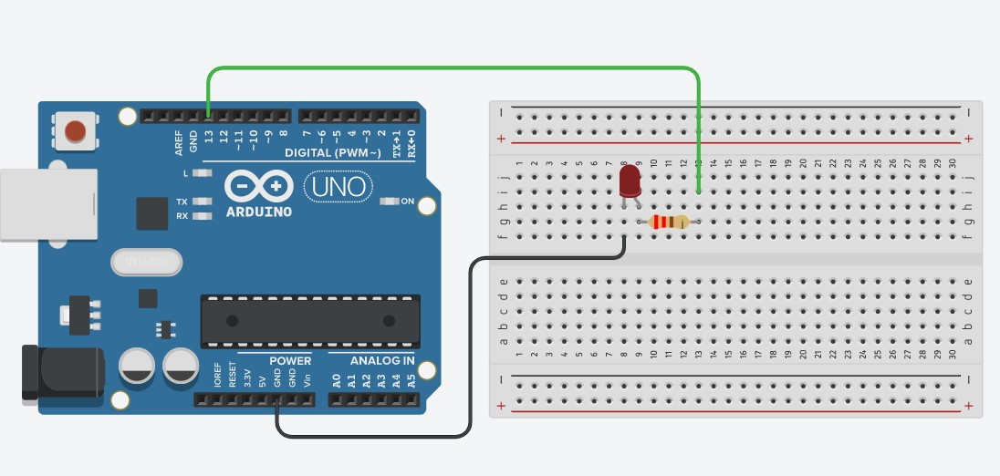
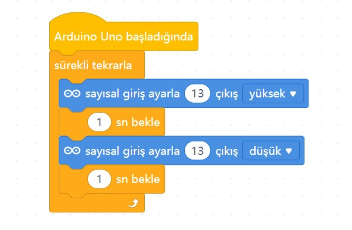

# Ders 01: Blink (Göz Kırpan LED) 💡

Çocukların mantıksal düşünme, problem çözme ve temel algoritma becerilerini geliştiren harika bir başlangıç projesiyle tanışın! Robotist’in Blink uygulaması, robotik kodlama dünyasına adım atarken elektrik devresi kurmayı ve donanımı kontrol etmeyi eğlenceli bir şekilde öğretiyor.

Bu projeyle çocuklar; döngü mantığını, bekleme sürelerini ve elektrik akımının nasıl çalıştığını keşfeder. Kendi elleriyle kurdukları devrede bir ışığın yanıp sönmesini izlemek, onların özgüvenini artırırken üreten bir nesil olma yolunda ilk kıvılcımı ateşler!

**Robotist ile keşfet, öğren, eğlen!**

---

## ⚙️ Gerekli Elemanlar

1. **Arduino Uno** (Zekamızı temsil eden kontrol kartı)
2. **Breadboard** (Devremizi kuracağımız delikli tahta)
3. **1x LED** (Işık saçan eleman)
4. **1x 220Ω Direnç** (LED'imizi fazla akımdan koruyan koruyucu)
5. **Jumper Kablolar** (Elektriği taşıyan yollarımız)

---

## 🔌 Devre Şeması

LED'lerin uzun bacağı **Anot (+)**, kısa bacağı **Katot (-)** kutbudur. 
*   **GND** pinini breadboard'un eksi (-) hattına bağlayın.
*   LED'in katot (-) bacağını 220Ω direnç üzerinden GND'ye bağlayın.
*   LED'in anot (+) bacağını ise Arduino'nun **13 numaralı dijital pinine** bağlayın.



---

## 🧩 mBlock Blok Kodları

mBlock 5 kullanarak kodlarımızı görsel bloklarla kolayca oluşturuyoruz. Bu sayede çocuklar kod yazmadan önce mantıksal sıralamayı öğrenir:

*   **Tetikleyici:** `Arduino Uno başladığında` bloğu ile kartımıza enerjiyi veriyoruz.
*   **Döngü:** `sürekli tekrarla` bloğu ile LED'in durmadan göz kırpmasını sağlıyoruz.
*   **İşlem:** Dijital pin 13'ü YÜKSEK (yak) yap -> 1 saniye bekle -> Dijital pin 13'ü DÜŞÜK (söndür) yap -> 1 saniye bekle.



---

## 💻 Arduino C/C++ Kodları

Projenin Arduino IDE ile yüklenebilecek geleneksel metin tabanlı C/C++ kodları:

```cpp
/*
  Ders 01: Blink (Göz Kırpan LED)
*/

const int ledPin = 13; // LED'in bağlı olduğu pin

void setup() {
  pinMode(ledPin, OUTPUT); // Pini çıkış olarak ayarlıyoruz
}

void loop() {
  digitalWrite(ledPin, HIGH); // LED'i yak (5V ver)
  delay(1000);                // 1 saniye bekle
  digitalWrite(ledPin, LOW);  // LED'i söndür (0V ver)
  delay(1000);                // 1 saniye bekle
}
```

---

## 🌐 Tinkercad Simülasyonu

Projeyi bilgisayarınızda kurmadan çevrimiçi simüle etmek isterseniz:
👉 **[Tinkercad Devresini İncele](https://www.tinkercad.com/)** *(Buraya kendi Tinkercad linkinizi ekleyebilirsiniz)*
