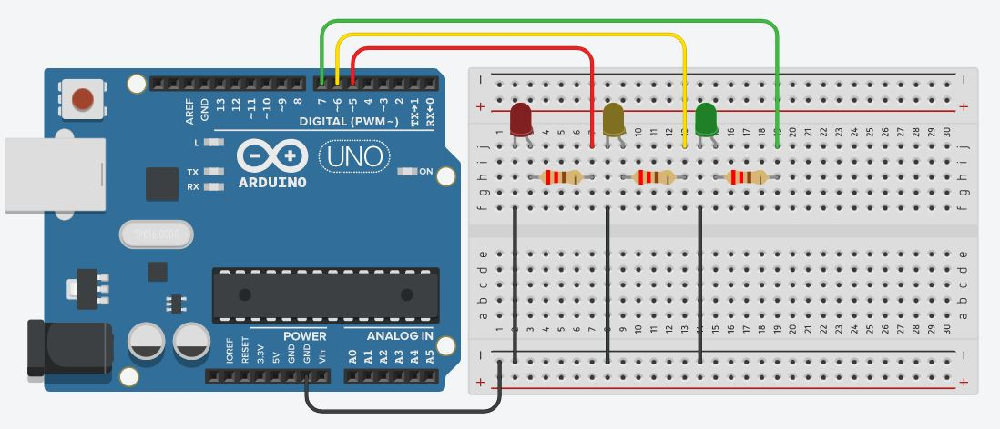
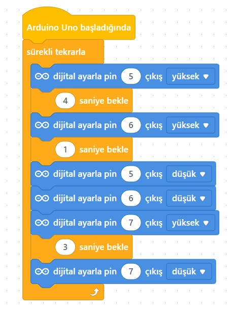

# Ders 02: Trafik Lambası 🚦

Bu dersimizde Kırmızı, Sarı ve Yeşil LED'lerimizi sırasıyla kontrol ederek gerçek bir trafik lambası simülasyonu gerçekleştireceğiz.

---

## ⚙️ Gerekli Elemanlar

1. **Arduino Uno**
2. **Breadboard**
3. **3x LED** (Kırmızı, Sarı, Yeşil)
4. **3x 220Ω Direnç**
5. **Jumper Kablolar**

---

## 🔌 Devre Şeması ve mBlock Blok Kodları

*Bu kısma ait resimleri `images/schematic.jpg` ve `images/mblock.jpg` olarak klasöre ekleyebilirsiniz.*

### Devre Kurulumu:
*   LED'lerin katot (-) bacaklarını dirençler üzerinden **GND** hattına bağlayın.
*   **Kırmızı LED** anot (+) ucunu -> Arduino **Pin 5**'e bağlayın.
*   **Sarı LED** anot (+) ucunu -> Arduino **Pin 6**'e bağlayın.
*   **Yeşil LED** anot (+) ucunu -> Arduino **Pin 7**'e bağlayın.



### mBlock Blokları:
*   **Kırmızı** yak, **Sarı** ve **Yeşil** söndür -> 3 sn bekle.
*   **Kırmızı** ve **Sarı** yak, **Yeşil** söndür -> 1 sn bekle.
*   **Yeşil** yak, **Kırmızı** ve **Sarı** söndür -> 3 sn bekle.
*   **Sarı** yak, **Kırmızı** ve **Yeşil** söndür -> 1 sn bekle.



---

## 💻 Arduino C/C++ Kodları

```cpp
const int kirmiziLed = 5;
const int sariLed = 6;
const int yesilLed = 7;

void setup() {
  pinMode(kirmiziLed, OUTPUT);
  pinMode(sariLed, OUTPUT);
  pinMode(yesilLed, OUTPUT);
}

void loop() {
  // Kırmızı ışık (3 saniye)
  digitalWrite(kirmiziLed, HIGH);
  digitalWrite(sariLed, LOW);
  digitalWrite(yesilLed, LOW);
  delay(3000);
  
  // Sarı ışık da katılır (1 saniye)
  digitalWrite(sariLed, HIGH);
  delay(1000);
  
  // Yeşil ışık (3 saniye)
  digitalWrite(kirmiziLed, LOW);
  digitalWrite(sariLed, LOW);
  digitalWrite(yesilLed, HIGH);
  delay(3000);
  
  // Yalnızca Sarı ışık (1 saniye)
  digitalWrite(yesilLed, LOW);
  digitalWrite(sariLed, HIGH);
  delay(1000);
}
```

---

## 🌐 Tinkercad Simülasyonu

👉 **[Tinkercad Devresini İncele](https://www.tinkercad.com/)**
