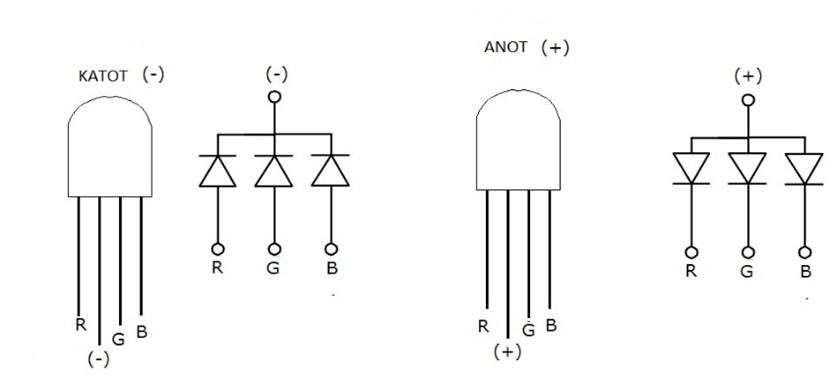
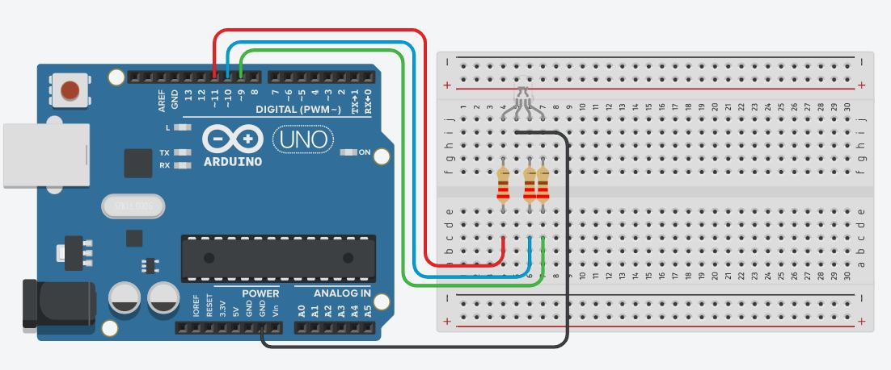
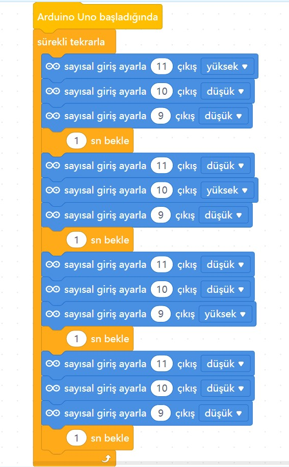

# Ders 04: RGB LED (Renkli Işık Dünyası) 🌈

Renklerin büyülü dünyasını kodlama ile keşfetmeye hazır mısınız? Robotist’in RGB LED uygulaması, çocukların ana renkleri (Kırmızı, Yeşil, Mavi) bir araya getirerek ara renkleri (Sarı, Mor, Turkuaz, Beyaz) nasıl oluşturacaklarını keşfetmelerini sağlar. Bu proje, hem görsel zekayı hem de renklerin fiziksel karışım mantığını eğlendirerek öğretir!

Bu projeyle çocuklar; çoklu çıkış kontrolünü, renk karışım algoritmalarını ve ortak anot/katot kavramlarını öğrenir. Kendi renklerini üretmek, onların yaratıcılık ve özgün proje geliştirme yeteneklerini besleyen harika bir adımdır!

**Robotist ile keşfet, öğren, eğlen!**

---

## 🎨 RGB LED Nedir? Ortak Katot ve Ortak Anot Farkı

RGB LED; Red (Kırmızı), Green (Yeşil) ve Blue (Mavi) kelimelerinin baş harflerinden oluşur. İçerisinde bu üç rengi üreten bağımsız led çipleri barındırır. Piyasada iki çeşidi bulunur:
*   **Ortak Katot RGB LED:** Eksi (-) uçları içeride birleştirilmiştir. Uzun bacak **GND** (-) hattına bağlanır. Renk pinlerine 5V (HIGH) verildiğinde renkler yanar (Biz bu projede ortak katot kullanacağız).
*   **Ortak Anot RGB LED:** Artı (+) uçları içeride birleştirilmiştir. Uzun bacak **5V** (+) hattına bağlanır. Renk pinlerine 0V (LOW) verildiğinde renkler yanar.



---

## ⚙️ Gerekli Elemanlar

1. **Arduino Uno** (Zekamızı temsil eden kontrol kartı)
2. **Breadboard** (Devremizi kuracağımız delikli tahta)
3. **1x Ortak Katot RGB LED** (Renk saçan elemanımız)
4. **3x 220Ω Direnç** (R, G ve B kanallarımızı fazla akımdan korumak için)
5. **Jumper Kablolar** (Bağlantı yollarımız)

---

## 🔌 Devre Şeması

RGB LED'imizin en uzun bacağı ortak eksi (katot) bacağıdır:
*   Uzun bacağı doğrudan Arduino **GND** pinine bağlayın.
*   **Kırmızı (R)** bacağını 220Ω direnç üzerinden -> Arduino **Pin 9**'a bağlayın.
*   **Yeşil (G)** bacağını 220Ω direnç üzerinden -> Arduino **Pin 10**'a bağlayın.
*   **Mavi (B)** bacağını 220Ω direnç üzerinden -> Arduino **Pin 11**'e bağlayın.



---

## 🧩 mBlock Blok Kodları

mBlock 5 ile RGB pinlerini sırayla YÜKSEK ve DÜŞÜK konumlarına getirerek dilediğimiz renk tonlarını karıştırıp elde ediyoruz:
*   **Kırmızı:** Pin 9 (Yüksek), Pin 10 (Düşük), Pin 11 (Düşük)
*   **Sarı (Kırmızı + Yeşil):** Pin 9 (Yüksek), Pin 10 (Yüksek), Pin 11 (Düşük)
*   **Beyaz (Tüm renkler açık):** Pin 9 (Yüksek), Pin 10 (Yüksek), Pin 11 (Yüksek)



---

## 💻 Arduino C/C++ Kodları

Projenin Arduino IDE ile yüklenebilecek metin tabanlı C/C++ kodları:

```cpp
/*
  Ders 04: RGB LED Uygulaması
*/

const int kirmiziPin = 9;
const int yesilPin = 10;
const int maviPin = 11;

void setup() {
  pinMode(kirmiziPin, OUTPUT);
  pinMode(yesilPin, OUTPUT);
  pinMode(maviPin, OUTPUT);
}

// Renk geçişlerini kontrol eden fonksiyon
void renkAyarla(int kirmizi, int yesil, int mavi) {
  digitalWrite(kirmiziPin, kirmizi);
  digitalWrite(yesilPin, yesil);
  digitalWrite(maviPin, mavi);
}

void loop() {
  renkAyarla(HIGH, LOW, LOW);   // Kırmızı
  delay(1000);
  renkAyarla(LOW, HIGH, LOW);   // Yeşil
  delay(1000);
  renkAyarla(LOW, LOW, HIGH);   // Mavi
  delay(1000);
  renkAyarla(HIGH, HIGH, LOW);  // Sarı
  delay(1000);
  renkAyarla(HIGH, LOW, HIGH);  // Magenta (Mor)
  delay(1000);
  renkAyarla(LOW, HIGH, HIGH);  // Cyan (Turkuaz)
  delay(1000);
  renkAyarla(HIGH, HIGH, HIGH); // Beyaz
  delay(1000);
}
```

---

## 🌐 Tinkercad Simülasyonu

Projeyi bilgisayarınızda kurmadan çevrimiçi simüle etmek isterseniz:
👉 **[Tinkercad Devresini İncele](https://www.tinkercad.com/)** *(Buraya kendi Tinkercad linkinizi ekleyebilirsiniz)*
