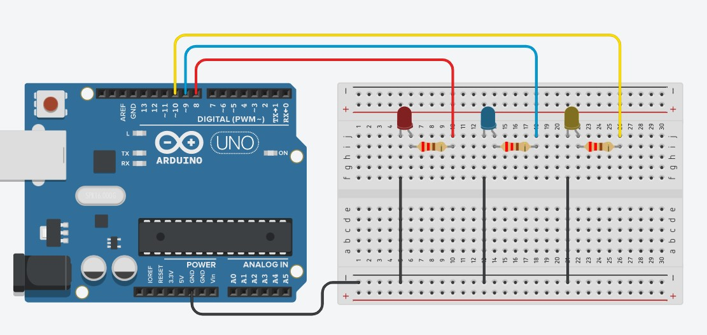
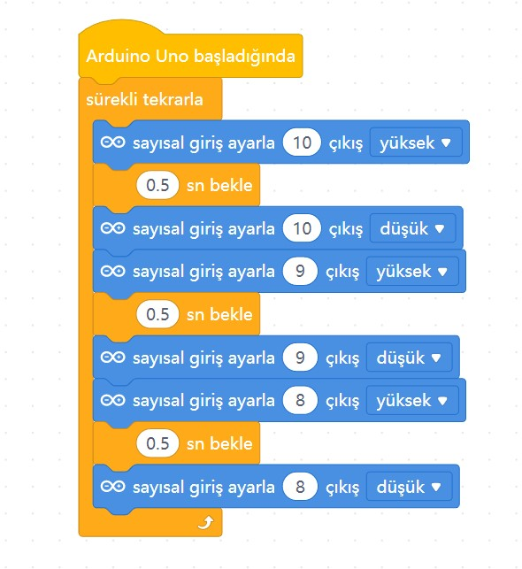

# Ders 05: Yürüyen Işık Devresi (Sıralı LED) 🏃‍♂️💡

Adım adım hareket eden ışıkların büyüleyici dünyasına hoş geldiniz! Robotist’in Yürüyen Işık uygulaması, çocukların birden fazla LED'i sıralı bir algoritma ile nasıl kontrol edeceklerini öğrenmelerini sağlar. Bu proje, çocuklara döngüsel mantık, zamanlama ve sıralı eylem dizileri planlama yetisi kazandırır!

Bu projeyle çocuklar; pinlerin sırayla açılıp kapanmasını kontrol etmeyi, algoritmalardaki ardışık adımların nasıl çalıştığını ve zamanlama parametrelerini yönetmeyi kavrar. Kendi ışık hareketlerini programlamak, onların mantıksal düşünme ve sistem tasarımı yeteneklerini zirveye taşır!

**Robotist ile keşfet, öğren, eğlen!**

---

## ⚙️ Gerekli Elemanlar

1. **Arduino Uno** (Zekamızı temsil eden kontrol kartı)
2. **Breadboard** (Devremizi kuracağımız delikli tahta)
3. **3x LED** (Yürüyen ışık efekti için)
4. **3x 220Ω Direnç** (LED'lerimizi fazla akımdan korumak için)
5. **Jumper Kablolar** (Bağlantı yollarımız)

---

## 🔌 Devre Şeması

Bu projede LED'lerin her birini farklı dijital pinlere bağlayarak sıralı kontrol ediyoruz:
*   LED'lerin katot (-) bacaklarını breadboard üzerinde ortaklaştırıp tek bir jumper kabloyla Arduino'nun **GND** pinine bağlayın.
*   **1. LED** anot (+) ucunu 220Ω direnç üzerinden -> Arduino **Pin 8**'e bağlayın.
*   **2. LED** anot (+) ucunu 220Ω direnç üzerinden -> Arduino **Pin 9**'a bağlayın.
*   **3. LED** anot (+) ucunu 220Ω direnç üzerinden -> Arduino **Pin 10**'a bağlayın.



---

## 🧩 mBlock Blok Kodları

mBlock 5 ile yürüyen ışık döngüsünü sıralı pin komutları ile oluşturuyoruz. Çocuklar bekleme sürelerini değiştirerek ışıkların geçiş hızını diledikleri gibi ayarlayabilirler:

*   **1. Adım:** Pin 8 (Yüksek), Pin 9 ve Pin 10 (Düşük) -> 0.5 saniye bekle.
*   **2. Adım:** Pin 9 (Yüksek), Pin 8 and Pin 10 (Düşük) -> 0.5 saniye bekle.
*   **3. Adım:** Pin 10 (Yüksek), Pin 8 and Pin 9 (Düşük) -> 0.5 saniye bekle.



---

## 💻 Arduino C/C++ Kodları

Projenin Arduino IDE ile yüklenebilecek metin tabanlı C/C++ kodları:

```cpp
/*
  Ders 05: Yürüyen Işık Devresi (Sıralı LED)
*/

const int led1 = 8;
const int led2 = 9;
const int led3 = 10;

void setup() {
  pinMode(led1, OUTPUT);
  pinMode(led2, OUTPUT);
  pinMode(led3, OUTPUT);
}

void loop() {
  // 1. LED yanar, diğerleri söner (0.5 saniye)
  digitalWrite(led1, HIGH);
  digitalWrite(led2, LOW);
  digitalWrite(led3, LOW);
  delay(500);
  
  // 2. LED yanar, diğerleri söner (0.5 saniye)
  digitalWrite(led1, LOW);
  digitalWrite(led2, HIGH);
  digitalWrite(led3, LOW);
  delay(500);
  
  // 3. LED yanar, diğerleri söner (0.5 saniye)
  digitalWrite(led1, LOW);
  digitalWrite(led2, LOW);
  digitalWrite(led3, HIGH);
  delay(500);
}
```

---

## 🌐 Tinkercad Simülasyonu

Projeyi bilgisayarınızda kurmadan çevrimiçi simüle etmek isterseniz:
👉 **[Tinkercad Devresini İncele](https://www.tinkercad.com/)** *(Buraya kendi Tinkercad linkinizi ekleyebilirsiniz)*
