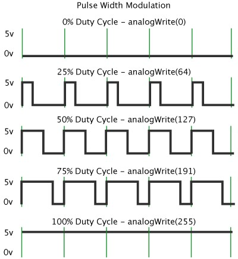
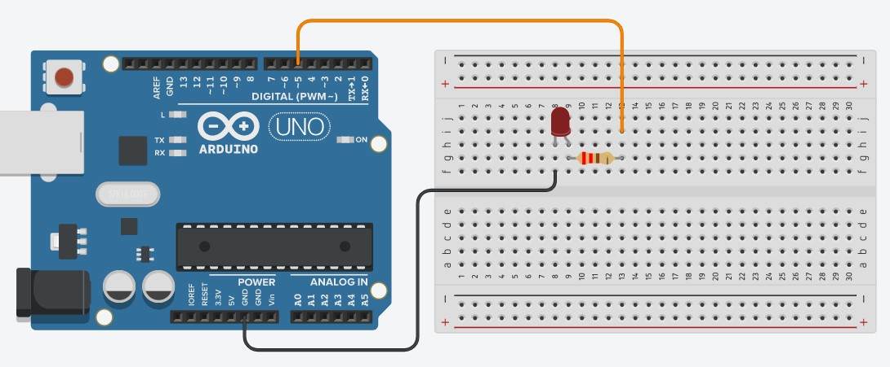
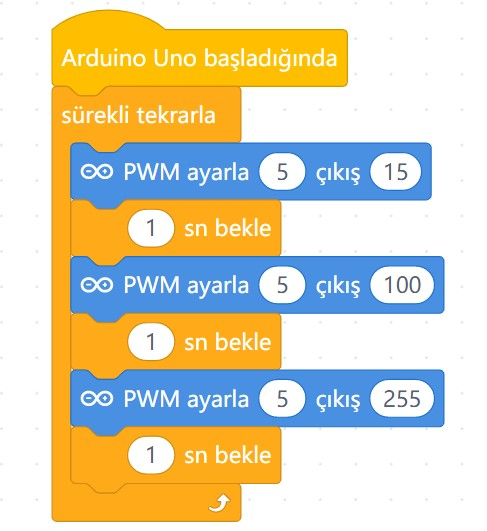

# Ders 06: PWM Sinyali ile LED Parlaklığı Ayarlama 💡📈

Işığın gücünü kontrol etmeyi öğrenmeye hazır mısınız? Robotist’in PWM (Darbe Genişlik Modülasyonu) uygulaması, çocukların sadece AÇIK/KAPALI (0 ve 1) mantığının dışına çıkarak ara voltaj değerleri oluşturmayı ve bir LED'in parlaklığını adım adım nasıl ayarlayacaklarını öğrenmelerini sağlar.

Bu projeyle çocuklar; PWM dalga yapısını, Duty Cycle (Doluluk Oranı) mantığını ve Arduino kartları üzerindeki donanımsal PWM pinlerinin ne işe yaradığını kavrar. Kademeli ışık geçişleri yapmak, onların fiziksel dünya ile kodlama arasındaki kontrol yetisini güçlendirir!

**Robotist ile keşfet, öğren, eğlen!**

---

## 📈 PWM (Sinyal Genişlik Modülasyonu) Nedir?

Arduino normalde dijital pinlerden sadece 0V (DÜŞÜK) veya 5V (YÜKSEK) verebilir. Ancak voltajı kısmamız gereken durumlarda (örneğin bir ledin parlaklığını kısmak veya motoru yavaşlatmak için) **PWM** tekniğini kullanırız.

PWM, gönderilen 5 Voltluk sinyali çok hızlı bir şekilde açıp kapatarak (kırparak) sanal bir ara voltaj değeri üretir. Bu açıp kapatma oranına **Duty Cycle (Doluluk Oranı)** denir:
*   **0 değeri (analogWrite):** Sinyal tamamen kapalıdır (0V).
*   **127 değeri (analogWrite):** Sinyal periyodun yarısında açık yarısında kapalıdır. LED'e yaklaşık 2.5V gider (%50 doluluk).
*   **255 değeri (analogWrite):** Sinyal tamamen açıktır (5V).



> [!NOTE]
> Arduino Uno kartında donanımsal olarak PWM desteği sunan 6 adet pin bulunur. Bu pinlerin yanında tilde **( ~ )** işareti bulunur: **3, 5, 6, 9, 10 ve 11**.

---

## ⚙️ Gerekli Elemanlar

1. **Arduino Uno** (Kontrol kartımız)
2. **Breadboard** (Bağlantı tahtamız)
3. **1x LED** (Parlaklığını ayarlayacağımız ışık kaynağı)
4. **1x 220Ω Direnç** (LED'imizi fazla akımdan korumak için)
5. **Jumper Kablolar**

---

## 🔌 Devre Şeması

LED'imizi mutlaka üzerinde tilde **( ~ )** işareti bulunan donanımsal bir PWM pinine bağlamalıyız:
*   LED'in anot (+) bacağını 220Ω direnç üzerinden Arduino **Pin 5**'e bağlayın.
*   LED'in katot (-) bacağını doğrudan Arduino **GND** pinine bağlayın.



---

## 🧩 mBlock Blok Kodları

mBlock 5'te PWM sinyali üretmek için normal sayısal çıkış bloğu yerine **"Analog çıkış ayarla"** bloğu kullanılır. Bu blok arka planda Arduino'nun `analogWrite()` fonksiyonunu çalıştırır. Işık seviyelerini sırasıyla 55, 127 ve 255 değerlerine ayarlayarak kademeli geçişler yapıyoruz:



---

## 💻 Arduino C/C++ Kodları

```cpp
/*
  Ders 06: PWM Sinyali ile LED Parlaklığı Ayarlama
*/

const int ledPin = 5;

void setup() {
  pinMode(ledPin, OUTPUT);
}

void loop() {
  // LED kısık yanar (55/255 parlaklık)
  analogWrite(ledPin, 55);
  delay(1000);
  
  // LED orta şiddette yanar (127/255 parlaklık)
  analogWrite(ledPin, 127);
  delay(1000);
  
  // LED en parlak seviyede yanar (255/255 parlaklık)
  analogWrite(ledPin, 255);
  delay(1000);
}
```

---

## 🌐 Tinkercad Simülasyonu

Projeyi bilgisayarınızda kurmadan çevrimiçi simüle etmek isterseniz:
👉 **[Tinkercad Devresini İncele](https://www.tinkercad.com/)**
