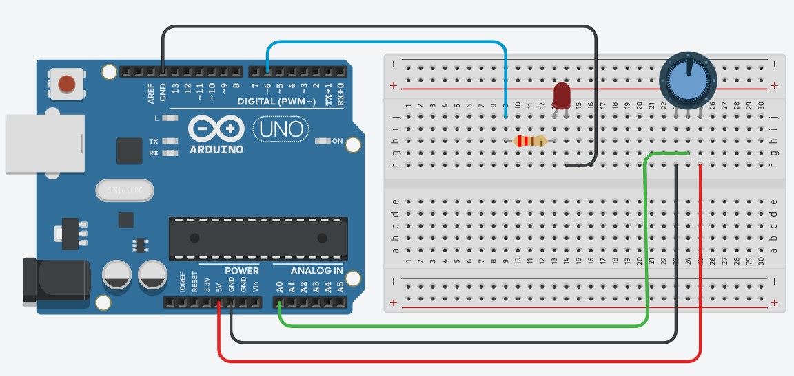
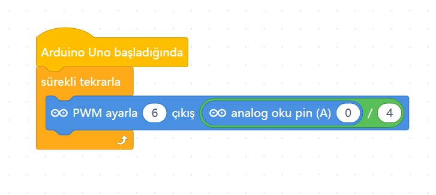

# Ders 07: Potansiyometre ile LED Parlaklığı Ayarlama 🎛️💡

Elektronik devrelerde ayar yapmanın en keyifli yolu! Robotist’in Potansiyometre ile LED Parlaklığı Ayarlama uygulaması, çocukların analog sinyalleri (0-1023 arası) okumayı, bu değerleri matematiksel olarak ölçeklendirmeyi ve bir LED'in ışık gücünü el hareketleriyle (tıpkı bir oda dimmer anahtarı gibi) kontrol etmeyi öğretir.

Bu projeyle çocuklar; potansiyometrenin çalışma prensibini, analog giriş/çıkış farklarını ve sinyal ölçekleme mantığını kavrar. Kendi fiziksel kumandalarını tasarlamak, onların kontrol sistemlerine olan ilgisini ve özgüvenini artırır!

**Robotist ile keşfet, öğren, eğlen!**

---

## 🎛️ Analog Sinyal ve Potansiyometre Nedir?

*   **Analog Sinyal:** Dijital sinyallerin aksine (sadece 0 veya 1), belli bir aralıkta sürekli değişen değerlere (örneğin sıcaklık, ışık şiddeti veya çevirme açısı) analog sinyal denir. Arduino analog pinleri, bu değişimi **0 ile 1023** arasında bir sayı olarak okur.
*   **Potansiyometre:** Dışarıdan elle çevrilerek değeri değiştirilebilen ayarlı bir dirençtir. Üç bacağı bulunur. Kenardaki bacaklar enerji (+5V ve GND) alırken, orta bacak çevrilme miktarına göre değişen analog voltajı Arduino'ya gönderir.

---

## ⚙️ Gerekli Elemanlar

1. **Arduino Uno** (Kontrol kartımız)
2. **Breadboard** (Bağlantı tahtamız)
3. **1x LED** (Işık seviyesini gözlemleyeceğimiz eleman)
4. **1x 10kΩ Potansiyometre** (Çevirmeli ayar düğmemiz)
5. **1x 220Ω Direnç** (LED'imizi fazla akımdan korumak için)
6. **Jumper Kablolar**

---

## 🔌 Devre Şeması

Bu projede potansiyometreyi analog girişe, LED'i ise PWM çıkışına bağlıyoruz:
*   **Potansiyometre:** Sol bacağını Arduino **5V** pinine, sağ bacağını **GND** pinine, orta bacağını ise analog giriş pini olan **A0**'a bağlayın.
*   **LED:** Anot (+) bacağını 220Ω direnç üzerinden Arduino **Pin 6**'ya (PWM), katot (-) bacağını doğrudan Arduino **GND** pinine bağlayın.



---

## 🧩 mBlock Blok Kodları

mBlock 5'te potansiyometreden gelen analog giriş değerini (0-1023) doğrudan analog çıkışa (0-255) veremeyiz. Bu yüzden A0 pininden okuduğumuz değeri **"4'e bölme"** matematiksel işlemi kullanarak PWM aralığına dönüştürüyoruz:



---

## 💻 Arduino C/C++ Kodları

```cpp
/*
  Ders 07: Potansiyometre ile LED Parlaklığı Ayarlama
*/

const int potPin = A0;
const int ledPin = 6;

void setup() {
  pinMode(ledPin, OUTPUT);
}

void loop() {
  // Potansiyometreden analog voltaj değeri okunur (0-1023)
  int potDeger = analogRead(potPin);
  
  // Değeri PWM aralığına (0-255) düşürmek için 4'e bölüyoruz
  int parlaklik = potDeger / 4;
  
  // LED'in parlaklığını ayarlıyoruz
  analogWrite(ledPin, parlaklik);
  
  delay(10); // Okumayı kararlı hale getirmek için kısa bekleme
}
```

---

## 🌐 Tinkercad Simülasyonu

Projeyi bilgisayarınızda kurmadan çevrimiçi simüle etmek isterseniz:
👉 **[Tinkercad Devresini İncele](https://www.tinkercad.com/)**
