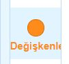
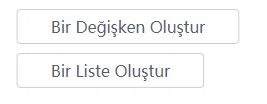
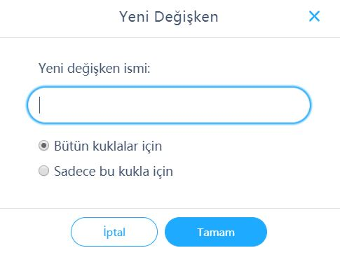
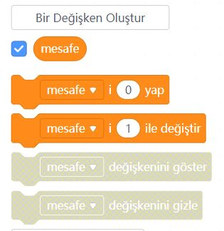

# Ders 08: mBlock ile Değişken Oluşturma (Variables) 📦🔢

Programlarımızın hafızasını oluşturan kutularla tanışmaya hazır mısınız? Robotist’in mBlock Değişken Oluşturma kılavuzu, çocukların kodlama dünyasının en temel yapı taşlarından biri olan "değişken" kavramını ve verileri hafızada nasıl saklayıp kullanacaklarını öğrenmelerini sağlar.

Bu projeyle çocuklar; değişkenin ne olduğunu, verileri nasıl saklayabileceklerini, mBlock'ta değişken oluşturma adımlarını ve Arduino modunda değişkenlerin nasıl çalıştığını kavrar. Kendi veri yönetim mekanizmalarını kurmak, onların soyut düşünme ve algoritma tasarlama becerilerini bir üst seviyeye taşır!

**Robotist ile keşfet, öğren, eğlen!**

---

## 📦 Değişken Nedir?

Kod yazarken bazı bilgileri (örneğin sensörlerden okuduğumuz sıcaklık, mesafe veya ledin durum bilgisi) daha sonra kullanmak üzere aklımızda tutmamız gerekir. Bu bilgileri kaydettiğimiz geçici bellek kutucuklarına **değişken (variable)** denir. 
Değişkenler tıpkı etiketli kutular gibidir; kutunun üzerine bir isim yazarız (örneğin `mesafe`) ve içine istediğimiz değeri koyup değiştirebiliriz.

---

## 🧩 mBlock 5'te Değişken Oluşturma Adımları

mBlock programında adım adım yeni bir değişken tanımlamak oldukça kolaydır:

1.  **Değişkenler Sekmesi:** Blok paletinden turuncu renkli **"Veri & Değişkenler"** (veya Değişkenler) kategorisine tıklayın.
    
    
    
2.  **Bir Değişken Oluştur:** Üst kısımda yer alan **"Bir Değişken Oluştur"** butonuna tıklayın.
    
    
    
3.  **İsimlendirme:** Açılan pencerede değişkeninize bir isim verin. Biz örnek olarak **"mesafe"** adını verdik.
    
    > [!IMPORTANT]
    > Değişken adı verirken Türkçe karakter (ç, ş, ğ, ı, ö, ü) kullanmamaya, boşluk bırakmamaya ve özel semboller kullanmamaya dikkat edin.
    
    
    
4.  **Kapsam Ayarı:** Eğer bu değişkeni sahnedeki bütün karakterlerin görmesini istiyorsanız **"Bütün kuklalar için"**, sadece seçili kuklanın görmesini istiyorsanız **"Sadece bu kukla için"** seçeneğini seçip **Tamam**'a tıklayın.

---

## 🧱 Arduino Modu ve Kukla Modu Farkı

Değişkeninizi oluşturduktan sonra kullanabileceğiniz bloklar görünür. mBlock'ta çalışma modunuza göre blok sayısı değişir:
*   **Kukla Modu (Sahne):** 5 farklı değişken bloğu aktif olur.
*   **Arduino Uno Cihaz Modu:** Arduino donanımı üzerinde çalışırken sadece **3 adet** blok kullanılabilir (değer atama, değeri artırma/azaltma ve değişkenin kendi yuvarlak bloğu).



---

## 💻 Arduino C/C++ Kodlarında Değişkenler

Arduino IDE metin kodlamasında değişken tanımlarken değişkenin saklayacağı verinin türünü (tipini) de belirtmemiz gerekir:

```cpp
/*
  Ders 08: Değişken Oluşturma ve Kullanımı (Variables)
*/

// Veri tiplerine göre değişken tanımlama
int mesafe = 100;          // Tam sayılar için (int)
float sicaklik = 24.5;     // Ondalıklı sayılar için (float)
char ledDurum = 'A';       // Tek karakterler için (char)
bool sistemCalisiyor = true; // Doğru/Yanlış değerleri için (bool)

void setup() {
  Serial.begin(9600); // Bilgisayar ile seri haberleşmeyi başlatır
  
  // Değerleri ekrana yazdırır
  Serial.print("Mesafe: ");
  Serial.println(mesafe);
  
  Serial.print("Sıcaklık: ");
  Serial.println(sicaklik);
}

void loop() {
  // Döngü boş kalabilir
}
```
