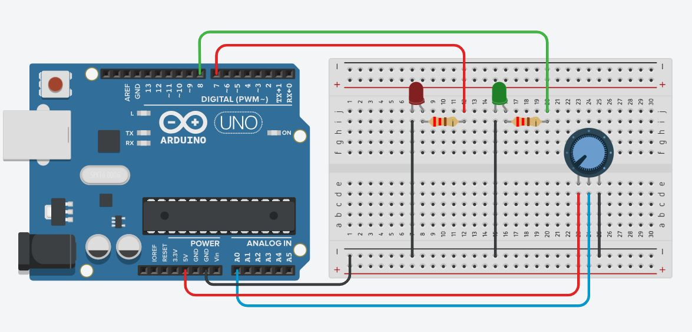
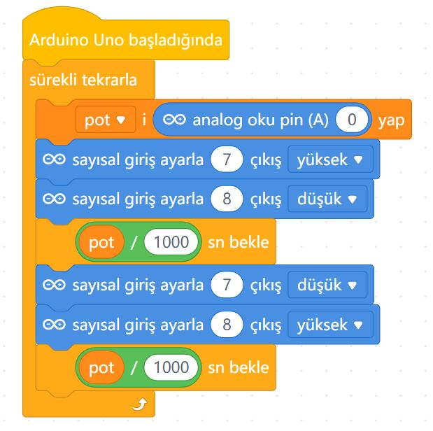

# Ders 09: Potansiyometre ile Flip Flop Devresi (Hız Ayarlı Flaşör) 🎛️🚨

Işıkların yanıp sönme hızını elinizle ayarlamaya ne dersiniz? Robotist’in Potansiyometre ile Flip Flop uygulaması, çocukların analog bir kontrol elemanından (potansiyometre) okudukları değerle zamanlama parametrelerini nasıl dinamik olarak değiştireceklerini öğrenmelerini sağlar.

Bu projeyle çocuklar; potansiyometre değerlerini zamanlama (bekleme) parametresi olarak kullanmayı, flip-flop (sıralı flaşör) mantığını ve analog/zaman ilişkisini kavrar. Kendi hız ayarlı flaşör sistemlerini tasarlamak, onların kontrol algoritmaları kurma becerilerini zirveye taşır!

**Robotist ile keşfet, öğren, eğlen!**

---

## 🚨 Flip Flop ve Zamanlama İlişkisi

*   **Flip Flop (Flaşör):** İki veya daha fazla LED'in sırayla ve döngüsel olarak yanıp sönmesiyle oluşan, polis çakarlarını andıran devredir.
*   **Zaman Kontrolü:** mBlock programında saniye cinsinden bekleme süresini kontrol ederiz. Potansiyometreden gelen değer 0 ile 1023 arasındadır. Değeri doğrudan saniye olarak kullanırsak bekleme süresi 1023 saniyeyi (yaklaşık 17 dakika!) bulabilir. Bu süreyi **1000'e bölerek** maksimum 1.023 saniye seviyesine düşürüyor ve harika bir flaşör hızı elde ediyoruz!

---

## ⚙️ Gerekli Elemanlar

1. **Arduino Uno** (Zekamız)
2. **Breadboard** (Bağlantı tahtamız)
3. **2x LED** (Sırayla yanıp sönecek ışıklarımız)
4. **2x 220Ω Direnç** (LED'lerimiz için akım koruması)
5. **1x 10kΩ Potansiyometre** (Hız ayar düğmemiz)
6. **Jumper Kablolar**

---

## 🔌 Devre Şeması

Bu projede potansiyometreyi analog girişe, LED'leri ise dijital çıkış pinlerine bağlıyoruz:
*   **Potansiyometre:** Kenar bacaklar Arduino **5V** ve **GND** pinlerine, orta bacak ise **A0** analog pinine bağlanır.
*   **LED 1:** Anot (+) ucu 220Ω direnç üzerinden -> Arduino **Pin 7**'ye bağlanır.
*   **LED 2:** Anot (+) ucu 220Ω direnç üzerinden -> Arduino **Pin 8**'e bağlanır.
*   LED'lerin katot (-) uçları ortak bir jumper kabloyla Arduino'nun **GND** pinine bağlanır.



---

## 🧩 mBlock Blok Kodları

mBlock 5'te potansiyometreden (A0) okunan değeri **"pot"** adlı bir değişken içine aktarıyoruz. Ardından LED'lerin bekleme süresini `pot / 1000` saniye olarak ayarlayıp hız kontrolünü tamamlıyoruz:



---

## 💻 Arduino C/C++ Kodları

```cpp
/*
  Ders 09: Potansiyometre ile Flip Flop Devresi
*/

const int potPin = A0;
const int led1 = 7;
const int led2 = 8;

void setup() {
  pinMode(led1, OUTPUT);
  pinMode(led2, OUTPUT);
}

void loop() {
  // Potansiyometre değerini milisaniye bekleme süresi olarak okuyoruz (0-1023 ms)
  int beklemeSuresi = analogRead(potPin);
  
  // 1. LED yanar, 2. LED söner
  digitalWrite(led1, HIGH);
  digitalWrite(led2, LOW);
  delay(beklemeSuresi);
  
  // Süreyi tekrar okuyarak dinamik tepki süresini koruyoruz
  beklemeSuresi = analogRead(potPin);
  
  // 1. LED söner, 2. LED yanar
  digitalWrite(led1, LOW);
  digitalWrite(led2, HIGH);
  delay(beklemeSuresi);
}
```

---

## 🌐 Tinkercad Simülasyonu

Projeyi bilgisayarınızda kurmadan çevrimiçi simüle etmek isterseniz:
👉 **[Tinkercad Devresini İncele](https://www.tinkercad.com/)**
