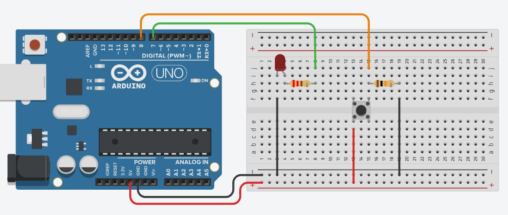
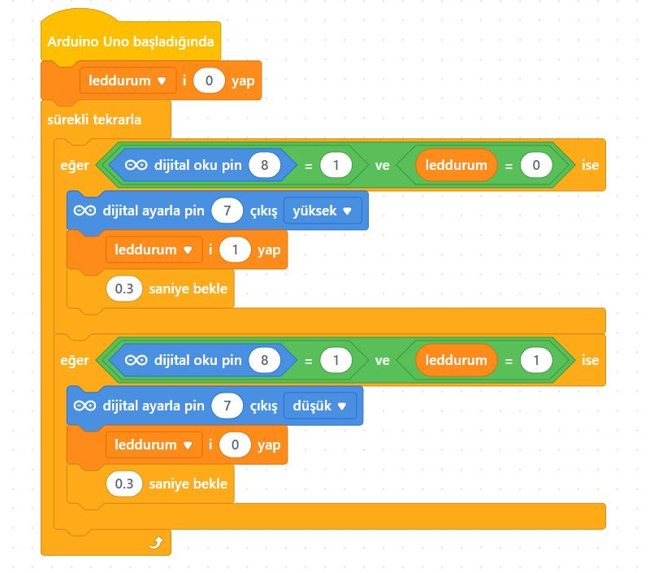

# Ders 10: Bir Buton ile LED Yakma Söndürme (Toggle) 🔘💡

Tek bir tuşla cihazlarımızı nasıl kontrol ettiğimizi öğrenmeye hazır mısınız? Robotist’in Bir Buton ile LED Yakma Söndürme uygulaması, çocukların sadece butona basılı tutarken değil, butona basıp çektiklerinde ledin durumunu nasıl kalıcı olarak değiştireceklerini (toggle) öğrenmelerini sağlar.

Bu projeyle çocuklar; dijital okuma komutunu, buton durum takibini, pull-down direnç bağlantısını ve buton arkı (bouncing) adı verilen elektriksel gürültüyü engelleme mantığını kavrar. Kendi açma-kapama anahtarlarını tasarlamak, onların akıllı cihazların çalışma mantığını anlamasını kolaylaştırır!

**Robotist ile keşfet, öğren, eğlen!**

---

## 🔘 Toggle (Durum Değiştirme) ve Debounce Mantığı

*   **Toggle (Durum Anahtarı):** Butona ilk basışta LED yanar ve elimizi çeksek bile yanmaya devam eder. Butona ikinci kez bastığımızda ise söner. Bu yapı tıpkı odamızın ışık anahtarı veya televizyonumuzun açma-kapama tuşu gibi çalışır.
*   **Debounce (Ark Önleme):** Butonlar mekanik yapılar olduğu için basıldığı an mikrosaniyeler içinde binlerce kez temas edip ayrılabilir (bouncing). Arduino bu kadar hızlı okuma yaptığı için butona tek bir kez basmamıza rağmen bunu çok kez basılmış gibi algılayabilir. Bunu engellemek için kodumuza kısa bir bekleme süresi (örneğin 0.5 saniye) yerleştiririz.

---

## ⚙️ Gerekli Elemanlar

1. **Arduino Uno** (Zekamız)
2. **Breadboard** (Bağlantı tahtamız)
3. **1x Push Buton** (Dört bacaklı basmalı butonumuz)
4. **1x LED** (Durumunu değiştireceğimiz ışık)
5. **1x 220Ω Direnç** (LED koruması için)
6. **1x 10kΩ Direnç** (Buton pull-down direnci için)
7. **Jumper Kablolar**

---

## 🔌 Devre Şeması

Bu projede butonu toprağa (GND) çekmek için Pull-Down direnci kullanıyoruz:
*   **LED:** Anot (+) bacağını 220Ω direnç üzerinden Arduino **Pin 7**'ye, katot (-) ucunu **GND**'ye bağlayın.
*   **Buton:** Bacaklarından birini Arduino **Pin 8**'e bağlayın. Aynı bacağa 10kΩ direnç bağlayıp direncin diğer ucunu **GND**'ye bağlayın (Pull-Down). Butonun karşısındaki bacağı ise doğrudan Arduino **5V** pinine bağlayın.



---

## 🧩 mBlock Blok Kodları

mBlock 5'te buton durumunu ve LED'in mevcut durumunu birlikte kontrol eden mantıksal sorgular oluşturuyoruz. Butona basıldığında LED'in durumunu kontrol ederek tersine çeviriyor ve ardından 0.5 saniye bekletiyoruz:



---

## 💻 Arduino C/C++ Kodları

```cpp
/*
  Ders 10: Bir Buton ile LED Yakma Söndürme (Toggle)
*/

const int ledPin = 7;
const int buttonPin = 8;

void setup() {
  pinMode(ledPin, OUTPUT);
  pinMode(buttonPin, INPUT);
}

void loop() {
  // Buton ve LED durumlarını okuyoruz
  int butonDurumu = digitalRead(buttonPin);
  int ledDurumu = digitalRead(ledPin);
  
  // Butona basıldıysa
  if (butonDurumu == HIGH) {
    if (ledDurumu == LOW) {
      digitalWrite(ledPin, HIGH); // LED sönükse yak
    } else {
      digitalWrite(ledPin, LOW);  // LED yanıyorsa söndür
    }
    delay(500); // Debounce (ark önleme) süresi
  }
}
```

---

## 🌐 Tinkercad Simülasyonu

Projeyi bilgisayarınızda kurmadan çevrimiçi simüle etmek isterseniz:
👉 **[Tinkercad Devresini İncele](https://www.tinkercad.com/)**
