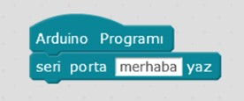
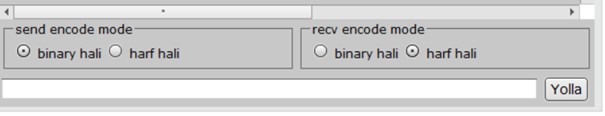
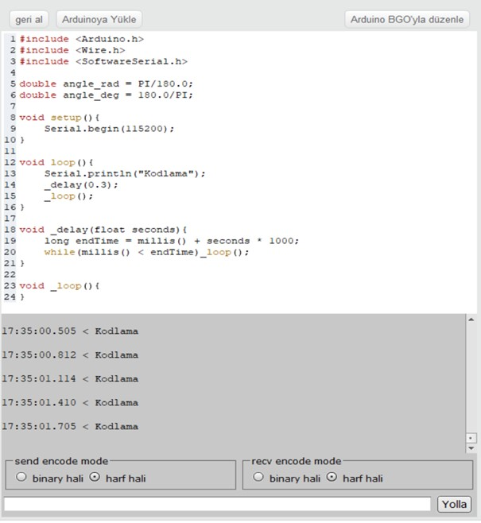
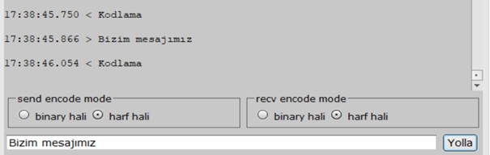

# Ders 11: mBlock 4 ile Seri Port (Seri Monitör) Kullanımı 🖥️💬

Arduino’muzun bizimle konuşmasını veya sensör değerlerini bilgisayarda görmemizi sağlayan köprüyü keşfetmeye hazır mısınız? Robotist’in mBlock 4 Seri Port kılavuzu, çocukların bilgisayar ile Arduino arasındaki seri haberleşmeyi (Serial Communication) anlamalarını ve sensör değerlerini anlık olarak ekrandan nasıl takip edeceklerini öğrenmelerini sağlar.

Bu projeyle çocuklar; seri port haberleşmesini, veri göndermeyi, mBlock 4 üzerinde "Arduino Kipi" ve "Seri Monitör" ekranını kullanmayı kavrar. Robotlarının ürettiği veriyi gözlemlemek, onların veri analizi ve hata ayıklama (debugging) becerilerini güçlendirir!

**Robotist ile keşfet, öğren, eğlen!**

---

## 💬 Seri Port Nedir?

*   **Seri Port / Monitör:** Arduino donanımının bilgisayara USB kablosu üzerinden veri göndermesini ve bilgisayardan veri almasını sağlayan dahili iletişim kanalıdır.
*   **Kullanım Amacı:** Özellikle LDR (ışık sensörü), Potansiyometre, HC-SR04 Mesafe sensörü gibi analog veya dijital veri okuyan sensörlerin anlık değerlerini görerek algoritmamızı test etmek ve kalibre etmek için vazgeçilmez bir araçtır.

---

## ⚙️ mBlock 4 Seri Port Ayarları

mBlock 4 programı üzerinde Seri Port ekranını kullanmak için şu adımları izlemeliyiz:

1.  **Arduino Programı Bloğu:** Robotlar kategorisinden en başa **"Arduino Programı"** bloğunu yerleştirin. Seri port ekranına veri göndermek için **"seri porta [mesaj] de"** bloğunu ekleyin.
    
    
    
2.  **Arduino Kipi Seçimi:** Üst menüden **Düzenle -> Arduino Kipi** seçeneğini işaretleyin. Böylece sağ tarafta C++ kod penceresi açılacaktır. Kod penceresinin altında yer alan iletişim modunu **"harf hali"** (recv encode mode) olarak seçin.
    
    
    
3.  **Yükleme ve Port Bağlantısı:** **Bağlan -> Seri Port** menüsünden kartınızın bağlı olduğu COM portunu seçin ve kodları Arduino kartına yükleyin.
    
    > [!IMPORTANT]
    > Kod yükleme işlemi tamamlandığında mBlock seri port bağlantısını otomatik olarak keser. Seri ekrandan gelen veriyi okuyabilmek için **Bağlan -> Seri Port** menüsüne gidip COM portunuzu **tekrar seçerek** bağlantıyı yeniden kurmalısınız!
    
4.  **Veriyi Gözlemleme:** Bağlantı sağlandıktan sonra sağ alt kısımdaki ekranda gönderilen mesajı (örneğin "Kodlama") görebilirsiniz.
    
    
    
5.  **Döngü İçinde Gönderme:** Mesajın sürekli olarak gitmesi ve okunabilir olması için blok şemamıza **"sürekli tekrarla"** ve **"1 saniye bekle"** bloklarını eklemeliyiz.
    
    

---

## 💻 Arduino C/C++ Kodları

Arduino IDE metin kodlamasında seri port haberleşmesi `Serial` kütüphanesi ile yönetilir:

```cpp
/*
  Ders 11: mBlock 4 ile Seri Port (Seri Monitör) Kullanımı
*/

void setup() {
  // Haberleşme hızını 9600 baud olarak ayarlayıp başlatıyoruz
  Serial.begin(9600); 
  
  // Ekrana tek bir kez "Kodlama" yazdırır
  Serial.println("Kodlama"); 
}

void loop() {
  // Eğer veriyi sürekli göndermek isteseydik:
  /*
  Serial.println("Kodlama");
  delay(1000); // 1 saniye bekle
  */
}
```
