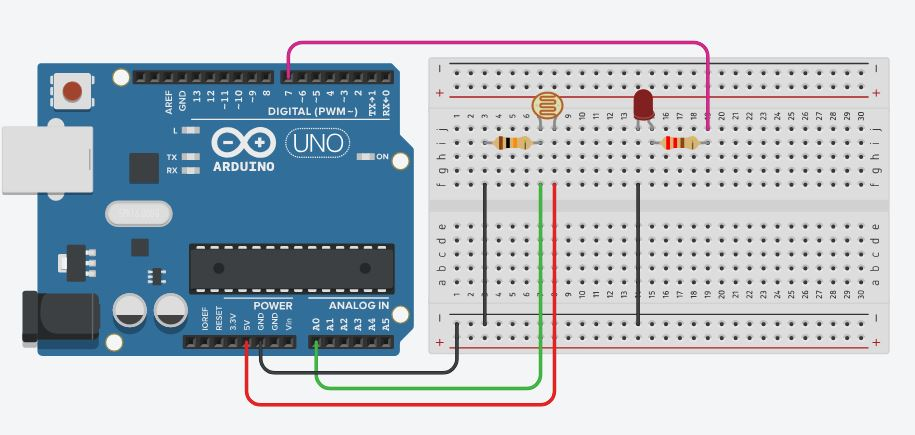
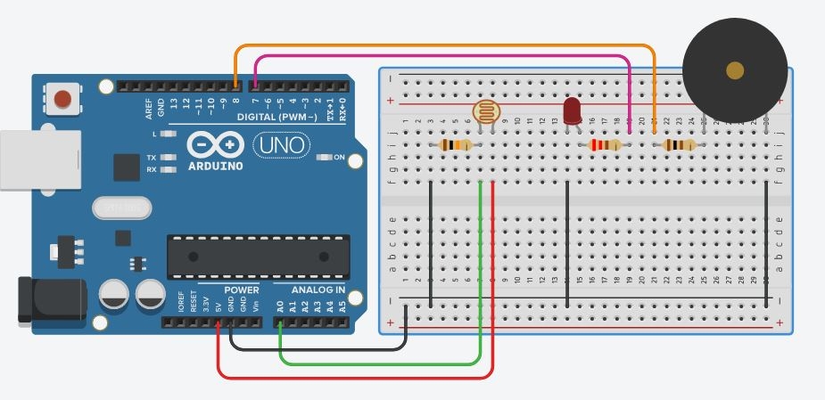
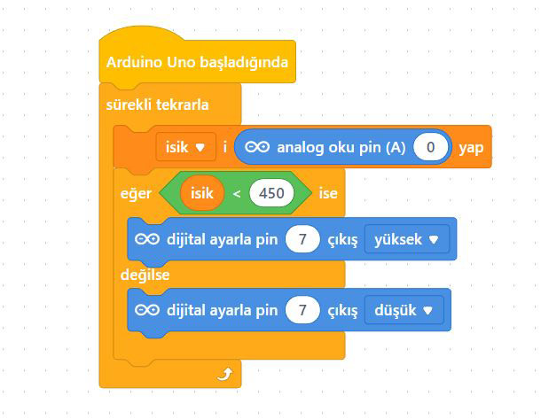
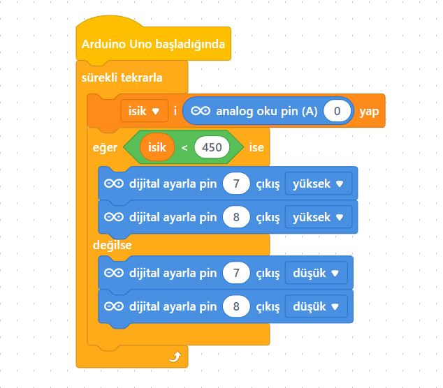

# Ders 12: LDR (Işık Sensörü) ile Sokak Lambası ve LED-Buzzer Alarmı ☀️🌙

Hava karardığında sokak lambalarının nasıl kendiliğinden yandığını merak ettiniz mi? Robotist’in LDR ile LED & Buzzer Alarm uygulaması, çocukların analog ışık sensörü (LDR) kullanarak çevredeki ışık miktarını ölçmesini ve bu değere göre otomatik sokak lambası veya ışığa duyarlı alarm sistemleri yapmasını sağlar.

Bu projeyle çocuklar; LDR (Light Dependent Resistor) çalışma prensibini, analog okuma komutunu, eşik değer (threshold) belirlemeyi ve birden fazla çıkış elemanını (LED ve Buzzer) aynı anda yönetmeyi kavrar. Akıllı çevre kontrol sistemleri kurmak, onların gerçek dünya problemlerine teknolojik çözümler üretme yeteneğini geliştirir!

**Robotist ile keşfet, öğren, eğlen!**

---

## ☀️ LDR (Işık Sensörü) Nedir?

*   **LDR (Light Dependent Resistor):** Üzerine düşen ışık miktarı arttıkça direnci azalan, ışık azaldıkça (karanlıkta) direnci artan foto-dirençtir.
*   **Çalışma Mantığı:** LDR'den okunan analog değer 0 (tam karanlık) ile 1023 (tam aydınlık) arasındadır. Yazdığımız algoritmada belirlediğimiz bir eşik değerin (örneğin `300`) altına düşüldüğünde ortamın karanlık olduğuna karar verip LED'i ve alarmı çalıştırırız.

---

## ⚙️ Gerekli Elemanlar

1. **Arduino Uno** (Zekamız)
2. **Breadboard** (Bağlantı tahtamız)
3. **1x LDR (Foto Direnç)** (Gözümüz)
4. **1x LED** (Sokak lambamız)
5. **1x Buzzer** (Alarm sesimiz)
6. **1x 10kΩ Direnç** (LDR için Pull-Down direnci)
7. **1x 220Ω Direnç** (LED koruması)
8. **1x 100Ω Direnç** (Buzzer ses seviyesi koruması - isteğe bağlı)
9. **Jumper Kablolar**

---

## 🔌 Devre Şeması

Projemizde iki farklı aşama kurabiliriz:

### A) Sokak Lambası Devresi (Sadece LED)
*   **LDR:** Bir ucu Arduino **5V** pinine, diğer ucu 10kΩ dirençle **GND** pinine bağlanır. LDR ile direncin birleştiği nokta **A0** analog pinine gider.
*   **LED:** Anot (+) ucu 220Ω direnç üzerinden Arduino **Pin 7**'ye, katot (-) ucu **GND**'ye bağlanır.



### B) Işık Alarmı Devresi (LED + Buzzer)
*   Sokak lambası devresine ek olarak:
*   **Buzzer:** Artı (+) ucu (100Ω direnç üzerinden veya doğrudan) Arduino **Pin 8**'ye, eksi (-) ucu **GND**'ye bağlanır.



---

## 🧩 mBlock Blok Kodları

mBlock 5'te analog A0 pininden okuduğumuz değeri **"isik"** değişkeni içerisine kaydediyoruz. Belirlediğimiz eşik değerin altında ve üstünde olmasına göre çıkışlarımızı yönetiyoruz:

### mBlock Sokak Lambası Blokları


### mBlock LED + Buzzer Alarmı Blokları


---

## 💻 Arduino C/C++ Kodları

```cpp
/*
  Ders 12: LDR (Işık Sensörü) ile Sokak Lambası ve LED-Buzzer Alarmı
*/

const int ldrPin = A0;
const int ledPin = 7;
const int buzzerPin = 8;
const int esikDeger = 300; // Ortamın ışığına göre burayı güncelleyebilirsiniz

void setup() {
  Serial.begin(9600); // LDR değerlerini ekranda görmek için
  pinMode(ledPin, OUTPUT);
  pinMode(buzzerPin, OUTPUT);
}

void loop() {
  int isikSeviyesi = analogRead(ldrPin);
  Serial.print("Işık Değeri: ");
  Serial.println(isikSeviyesi);
  
  if (isikSeviyesi < esikDeger) {
    // Karanlıksa led yansın ve alarm çalsın
    digitalWrite(ledPin, HIGH);
    digitalWrite(buzzerPin, HIGH);
  } else {
    // Aydınlıkta sönsünler
    digitalWrite(ledPin, LOW);
    digitalWrite(buzzerPin, LOW);
  }
  delay(100);
}
```

---

## 🌐 Tinkercad Simülasyonu

Projeyi bilgisayarınızda kurmadan çevrimiçi simüle etmek isterseniz:
👉 **[Tinkercad Devresini İncele](https://www.tinkercad.com/)**
