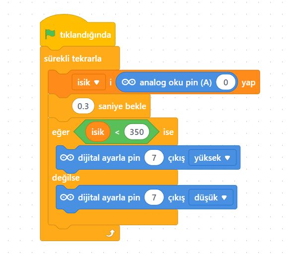
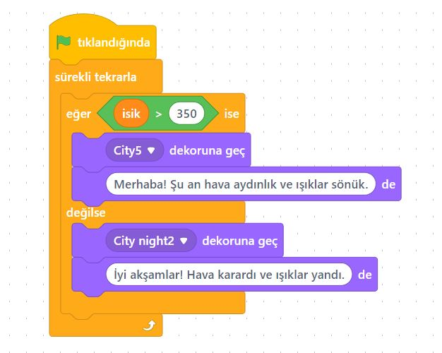
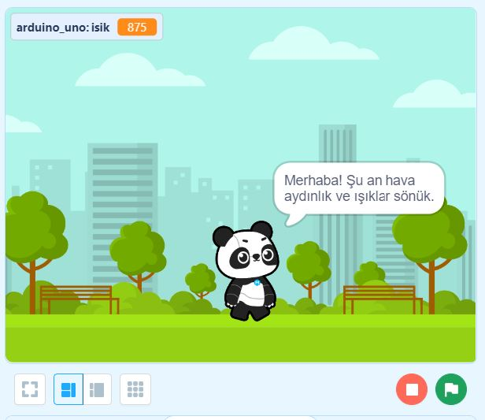
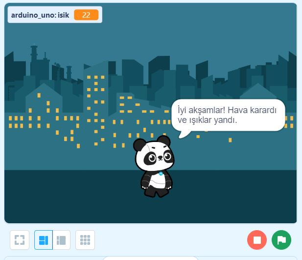

# Ders 13: LDR (Işık Sensörü) ile Canlı Mod (Live Mode) Sokak Lambası 🎬🌗

Kodlarımızın sonucunu sadece devre üzerinde değil, bilgisayar ekranımızdaki eğlenceli animasyonlarla da görmek ister misiniz? Robotist’in LDR ile Canlı Mod uygulaması, çocukların Arduino donanımını mBlock sahnesi ile çift yönlü olarak anlık konuşturmasını (Live mode) ve ortam ışık şiddetine göre ekrandaki bir kuklayı veya sahne arka planını (Gece/Gündüz) nasıl değiştireceklerini öğrenmelerini sağlar.

Bu projeyle çocuklar; mBlock Canlı Mod (Live Mode) bağlantısını, eklenti ("Yükleme Modu Yayını" / "Upload Mode Broadcast") eklemeyi, donanım verilerini sahne kuklalarına aktarmayı ve etkileşimli oyun/simülasyon mantığını kavrar. Fiziksel dünya ile dijital dünyayı birleştirmek, onların kodlama projelerine olan ilgisini bambaşka bir boyuta taşır!

**Robotist ile keşfet, öğren, eğlen!**

---

## 🌗 Canlı Mod (Live Mode) Nedir?

*   **Canlı Mod:** Kodları Arduino kartına yüklemeden, bilgisayara bağlı durumdayken yapılan değişikliklerin anlık olarak çalıştırılmasıdır. 
*   **Çift Yönlü Etkileşim:** Arduino'daki LDR sensöründen gelen ışık verisini mBlock sahnesindeki kuklaya göndeririz. Işık değeri eşik seviyenin altına indiğinde mBlock sahnesi **"Gece"** arka planına geçer ve kukla **"İyi Geceler!"** der. Işık değeri normal seviyeye çıktığında ise **"Gündüz"** arka planı açılır ve kukla **"Günaydın!"** mesajını verir.

---

## ⚙️ Gerekli Elemanlar

1. **Arduino Uno** (Zekamız)
2. **Breadboard** (Bağlantı tahtamız)
3. **1x LDR (Foto Direnç)** (Gözümüz)
4. **1x LED** (Sokak lambamız)
5. **1x 10kΩ Direnç** (LDR Pull-Down direnci)
6. **1x 220Ω Direnç** (LED koruması)
7. **Jumper Kablolar**

---

## 🔌 Devre Şeması

*   **LDR:** Bir ucu Arduino **5V** pinine, diğer ucu 10kΩ dirençle **GND** pinine bağlanır. LDR ile direncin birleştiği nokta **A0** analog pinine gider.
*   **LED:** Anot (+) ucu 220Ω direnç üzerinden Arduino **Pin 7**'ye, katot (-) ucu **GND**'ye bağlanır.


---

## 🛠️ mBlock 5 Canlı Mod Eklenti ve Bağlantı Kurulumu

mBlock 5 üzerinde canlı etkileşimi kurmak için eklentileri şu şekilde yüklemeliyiz:

1.  **Cihaz Eklentisi Ekleme:**
    *   **Aygıtlar** sekmesinde Arduino Uno seçili iken sol taraftaki uzantılar altındaki **"+ uzantı"** yazısına tıklayın.
    *   Açılan pencereden **"Yükleme Modu Yayını"** (veya İngilizce sürümde **"Upload Mode Broadcast"**) uzantısını bulup ekleyin.
2.  **Kukla Eklentisi Ekleme:**
    *   **Kuklalar** sekmesine tıklayın, alt taraftan **"+ uzantı"** yazısına basın.
    *   Burada da aynı şekilde **"Yükleme Modu Yayını"** eklentisini ekleyin.

---

## 🧩 mBlock Canlı Mod Blok Kodları

Aygıtlar ve Kuklalar sekmelerinde oluşturacağımız kodlar şu şekildedir:

### 1. Aygıtlar (Arduino Uno) Blokları
Arduino tarafında LDR analog değerini sürekli okuyup canlı yayın kanalıyla sahneye aktarıyoruz:



### 2. Kuklalar (Sahne/Sprite) Blokları
Kuklalar tarafında gelen ışık değerini dinleyerek arka planı (Gece/Gündüz) ve kuklanın konuşmalarını değiştiriyoruz:



### 🎬 Canlı Mod Ekran Görüntüleri
*   **Aydınlık Ortam (Gündüz):**
    
*   **Karanlık Ortam (Gece):**
    

---

## 💻 Arduino C/C++ Kodları

Eğer bu devreyi tamamen bilgisayardan bağımsız ve sadece seri porta değer yazacak şekilde C/C++ olarak çalıştırmak isterseniz:

```cpp
/*
  Ders 13: LDR ile Canlı Mod (Live Mode) Sokak Lambası
*/

const int ldrPin = A0;
const int ledPin = 7;
const int esikDeger = 350;

void setup() {
  Serial.begin(9600); // LDR verisini seri monitörde göstermek için
  pinMode(ledPin, OUTPUT);
}

void loop() {
  int isikSeviyesi = analogRead(ldrPin);
  Serial.println(isikSeviyesi); // mBlock canlı yayın verisi
  
  if (isikSeviyesi < esikDeger) {
    digitalWrite(ledPin, HIGH); // Karanlıkta LED yansın
  } else {
    digitalWrite(ledPin, LOW);  // Aydınlıkta LED sönsün
  }
  delay(100);
}
```
