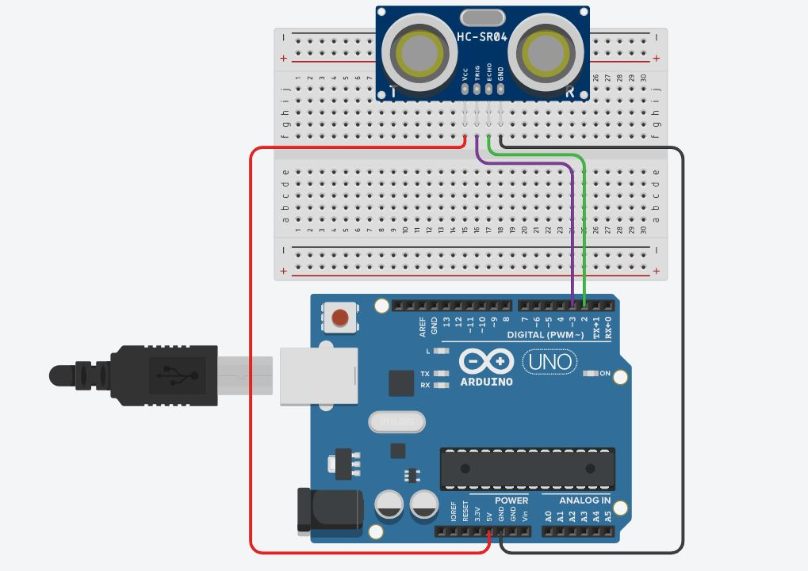
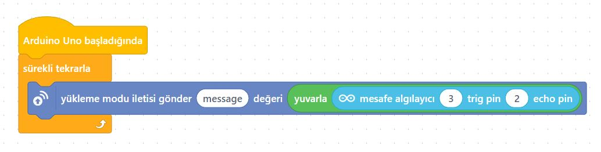
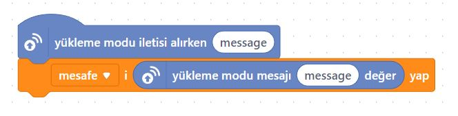
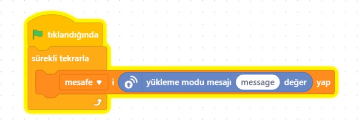
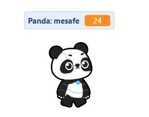

# Ders 14: HC-SR04 Ultrasonik Sensör ile Mesafe Ölçümü 📏🦇

Yarasaların karanlıkta yönlerini nasıl bulduklarını biliyor musunuz? Robotist’in HC-SR04 Mesafe Ölçümü uygulaması, çocukların ses dalgalarının yansıma hızını kullanarak önlerindeki cisimlerin mesafesini tıpkı yarasalar gibi ölçmeyi öğrenmelerini sağlar.

Bu projeyle çocuklar; ultrasonik (ses dalgası) sensörlerin çalışma prensibini, Trig ve Echo sinyal tetikleme adımlarını, süre-mesafe fiziksel dönüşüm formülünü ve değişken yönetimini kavrar. Mesafe ölçümü yapmak, onların otonom engelden kaçan robotlar ve akıllı park sistemleri tasarlamalarının temelini oluşturur!

**Robotist ile keşfet, öğren, eğlen!**

---

## 🦇 HC-SR04 Ultrasonik Sensör Nasıl Çalışır?

*   **Çalışma Mantığı:** HC-SR04 sensörü üzerinde iki adet silindirik göz bulundurur. Bunlardan **Trig** gözü dışarıya insan kulağının duyamayacağı yükseklikte bir ses dalgası fırlatır. Bu dalga bir cisme çarpıp geri döner ve **Echo** gözü tarafından yakalanır.
*   **Mesafe Hesabı:** Ses dalgasının gidiş-dönüş süresi hesaplanır. Sesin havadaki yayılma hızı (~340 m/s) kullanılarak süre/2 değeri üzerinden cm cinsinden kesin mesafe hesaplanır:
    $$\text{Mesafe (cm)} = \frac{\text{Süre} \times 0.034}{2}$$

---

## ⚙️ Gerekli Elemanlar

1. **Arduino Uno** (Zekamız)
2. **Breadboard** (Bağlantı tahtamız)
3. **1x HC-SR04 Ultrasonik Sensör** (Gözümüz)
4. **Jumper Kablolar**

---

## 🔌 Devre Şeması

HC-SR04 doğrudan breadboard üzerine takılarak 4 adet kablo ile Arduino'ya bağlanır:
*   **Vcc:** Arduino **5V** pinine
*   **Gnd:** Arduino **GND** pinine
*   **Trig (Tetikleme):** Arduino **Pin 3**'e
*   **Echo (Okuma):** Arduino **Pin 2**'ye



---

## 🧩 mBlock Blok Kodları

mBlock 5 üzerinde **"mesafe"** adında bir değişken tanımlayarak ultrasonik sensör bloğundan okunan değeri bu değişkene eşitliyoruz. Değeri sahnede canlı görmek için Canlı Mod eklentilerini (Ders 13'te öğrendiğimiz gibi) kullanabiliriz:

### 1. Aygıtlar (Arduino Uno) Blokları


### 2. Kuklalar (Panda/Sahne) Blokları
Panda kuklamızın yeşil bayrağa basınca sensörden gelen değerleri okuyup konuşmasını sağlayan kod blokları:
*   **Seçenek A:**
    
*   **Seçenek B (Tıklanınca / Yeşil Bayrak):**
    

### 🐼 Çalışma Sonucu (mBlock Ekranı)


---

## 💻 Arduino C/C++ Kodları

```cpp
/*
  Ders 14: HC-SR04 Ultrasonik Sensör ile Mesafe Ölçümü
*/

const int trigPin = 3;
const int echoPin = 2;

long sure;
int mesafe;

void setup() {
  Serial.begin(9600); // Ölçülen değeri ekranda görmek için
  pinMode(trigPin, OUTPUT);
  pinMode(echoPin, INPUT);
}

void loop() {
  // Tetikleme sinyali gönderiliyor
  digitalWrite(trigPin, LOW);
  delayMicroseconds(2);
  digitalWrite(trigPin, HIGH);
  delayMicroseconds(10);
  digitalWrite(trigPin, LOW);
  
  // Süre ölçülüyor
  sure = pulseIn(echoPin, HIGH);
  
  // Mesafe hesaplanıyor (cm cinsinden)
  mesafe = sure * 0.034 / 2;
  
  Serial.print("Ölçülen Mesafe: ");
  Serial.print(mesafe);
  Serial.println(" cm");
  
  delay(250); // Çeyrek saniye bekleme
}
```

---

## 🌐 Tinkercad Simülasyonu

Projeyi bilgisayarınızda kurmadan çevrimiçi simüle etmek isterseniz:
👉 **[Tinkercad Devresini İncele](https://www.tinkercad.com/)**
