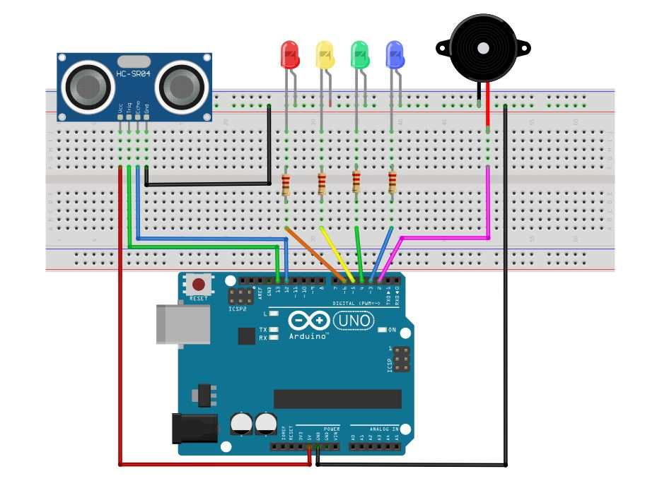
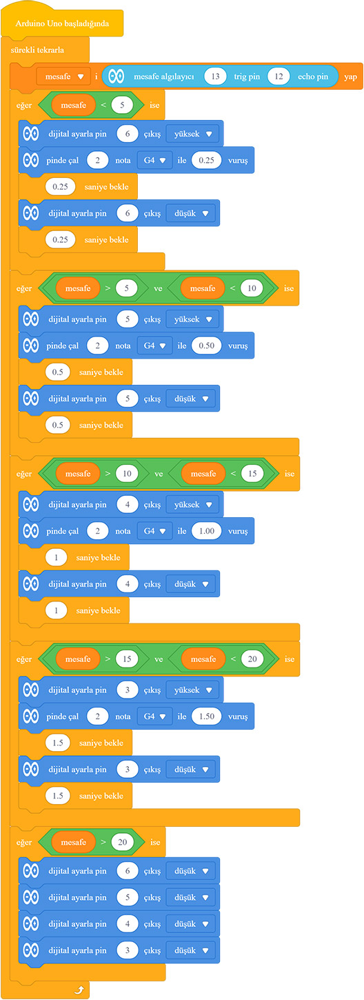
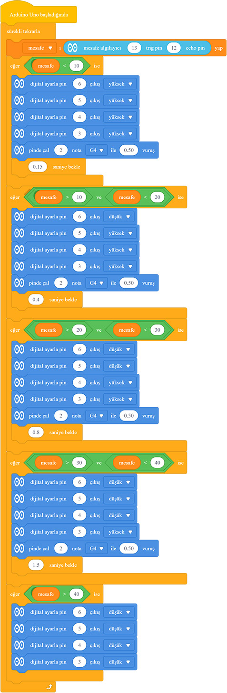

# Ders 15: HC-SR04 ile Kademeli Araç Park Sensörü 🚗🔊🚨

Modern arabaların arkaya doğru yanaşırken nasıl kesik kesik "bip bip" diye öttüğünü ve yaklaştıkça bu sesin nasıl hızlandığını fark ettiniz mi? Robotist’in Araç Park Sensörü uygulaması, çocukların mesafe sensörü, ledler ve buzzerı birleştirerek gerçek bir araba park yardım radarını baştan sona tasarlamasını sağlar.

Bu projeyle çocuklar; koşul ifadelerini (if-else), birden fazla çıkış elemanının senkronize kontrolünü, mesafe aralıklarına göre değişken bekleme süreleri tanımlamayı ve karmaşık algoritmik yapıları kurmayı kavrar. Hayatın içindeki bir teknolojiyi kendi elleriyle üretmek, onların mühendislik becerilerini en üst seviyeye çıkarır!

**Robotist ile keşfet, öğren, eğlen!**

---

## 🚗 Park Sensörü Çalışma Aşamaları

Projemizde engelle sensör arasındaki mesafeyi 4 ana kademeye ayırıyoruz:
1.  **Güvenli Alan (>40 cm):** Tüm ledler sönük, buzzer sessiz.
2.  **Seviye 1 (30 - 40 cm):** Sadece Mavi LED yanar, buzzer **1.5 saniye** aralıklarla yavaşça bipleyerek uyarır.
3.  **Seviye 2 (20 - 30 cm):** Mavi ve Yeşil LED birlikte yanar, buzzer **0.8 saniye** aralıklarla orta hızda uyarır.
4.  **Seviye 3 (10 - 20 cm):** Mavi, Yeşil ve Sarı LED birlikte yanar, buzzer **0.4 saniye** aralıklarla hızlıca uyarır.
5.  **Tehlike Seviyesi (<10 cm):** Tüm LED'ler (Kırmızı dahil) yanar, buzzer **0.15 saniye** aralıklarla kesintisiz ve çok hızlı bipleme yapar.

---

## ⚙️ Gerekli Elemanlar

1. **Arduino Uno** (Zekamız)
2. **Breadboard** (Bağlantı tahtamız)
3. **1x HC-SR04 Mesafe Sensörü** (Gözümüz)
4. **4x LED** (Görsel göstergemiz - Mavi, Yeşil, Sarı, Kırmızı)
5. **1x Buzzer** (Sesli uyarıcımız)
6. **4x 220Ω Direnç** (LED'ler için)
7. **Jumper Kablolar**

---

## 🔌 Devre Şeması

*   **HC-SR04:** Vcc ➡️ **5V**, Gnd ➡️ **GND**, Trig ➡️ **Pin 13**, Echo ➡️ **Pin 12**
*   **LED'ler:** Artı (+) bacakları 220Ω dirençler üzerinden sırasıyla **Pin 6, 5, 4, 3**'e bağlanır. Eksi (-) bacaklar **GND**'de birleşir.
*   **Buzzer:** Artı (+) bacak **Pin 2**'ye, eksi (-) bacak **GND**'ye bağlanır.



---

## 🧩 mBlock Blok Kodları

mBlock 5'te bu projeyi iki farklı LED yakma tarzında kodlayabiliriz:

### A) Birikmeli Yanan LED'ler (Cumulative)
Uzaklık azaldıkça yanan LED sayısının birikerek artmasını sağlar:



### B) Teker Teker Kademeli Yanan LED'ler
Her mesafe kademesinde sadece ilgili tek bir LED'in yanmasını sağlar:



---

## 💻 Arduino C/C++ Kodları

```cpp
/*
  Ders 15: HC-SR04 ile Kademeli Araç Park Sensörü
*/

const int trigPin = 13;
const int echoPin = 12;

const int ledMavi = 6;
const int ledYesil = 5;
const int ledSari = 4;
const int ledKirmizi = 3;
const int buzzerPin = 2;

long sure;
int mesafe;

void setup() {
  Serial.begin(9600);
  pinMode(trigPin, OUTPUT);
  pinMode(echoPin, INPUT);
  
  pinMode(ledMavi, OUTPUT);
  pinMode(ledYesil, OUTPUT);
  pinMode(ledSari, OUTPUT);
  pinMode(ledKirmizi, OUTPUT);
  pinMode(buzzerPin, OUTPUT);
}

void loop() {
  // Sensör tetikleniyor
  digitalWrite(trigPin, LOW);
  delayMicroseconds(2);
  digitalWrite(trigPin, HIGH);
  delayMicroseconds(10);
  digitalWrite(trigPin, LOW);
  
  sure = pulseIn(echoPin, HIGH);
  mesafe = sure * 0.034 / 2;
  
  Serial.print("Mesafe: ");
  Serial.println(mesafe);
  
  if (mesafe > 40) {
    digitalWrite(ledMavi, LOW);
    digitalWrite(ledYesil, LOW);
    digitalWrite(ledSari, LOW);
    digitalWrite(ledKirmizi, LOW);
    digitalWrite(buzzerPin, LOW);
    delay(200);
  } 
  else if (mesafe > 30 && mesafe <= 40) {
    digitalWrite(ledMavi, HIGH);
    digitalWrite(ledYesil, LOW);
    digitalWrite(ledSari, LOW);
    digitalWrite(ledKirmizi, LOW);
    
    digitalWrite(buzzerPin, HIGH);
    delay(100);
    digitalWrite(buzzerPin, LOW);
    delay(1400);
  } 
  else if (mesafe > 20 && mesafe <= 30) {
    digitalWrite(ledMavi, HIGH);
    digitalWrite(ledYesil, HIGH);
    digitalWrite(ledSari, LOW);
    digitalWrite(ledKirmizi, LOW);
    
    digitalWrite(buzzerPin, HIGH);
    delay(100);
    digitalWrite(buzzerPin, LOW);
    delay(700);
  } 
  else if (mesafe > 10 && mesafe <= 20) {
    digitalWrite(ledMavi, HIGH);
    digitalWrite(ledYesil, HIGH);
    digitalWrite(ledSari, HIGH);
    digitalWrite(ledKirmizi, LOW);
    
    digitalWrite(buzzerPin, HIGH);
    delay(100);
    digitalWrite(buzzerPin, LOW);
    delay(300);
  } 
  else {
    digitalWrite(ledMavi, HIGH);
    digitalWrite(ledYesil, HIGH);
    digitalWrite(ledSari, HIGH);
    digitalWrite(ledKirmizi, HIGH);
    
    digitalWrite(buzzerPin, HIGH);
    delay(75);
    digitalWrite(buzzerPin, LOW);
    delay(75);
  }
}
```

---

## 🌐 Tinkercad Simülasyonu

Projeyi bilgisayarınızda kurmadan çevrimiçi simüle etmek isterseniz:
👉 **[Tinkercad Devresini İncele](https://www.tinkercad.com/)**
