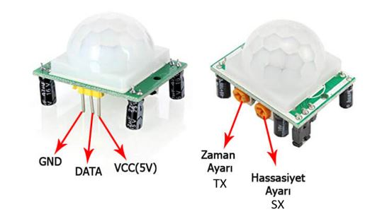
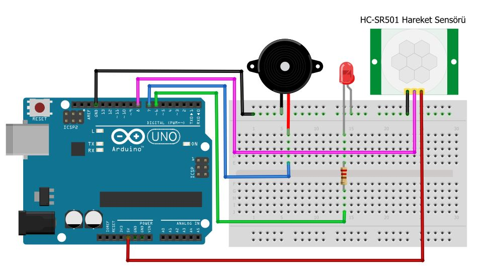
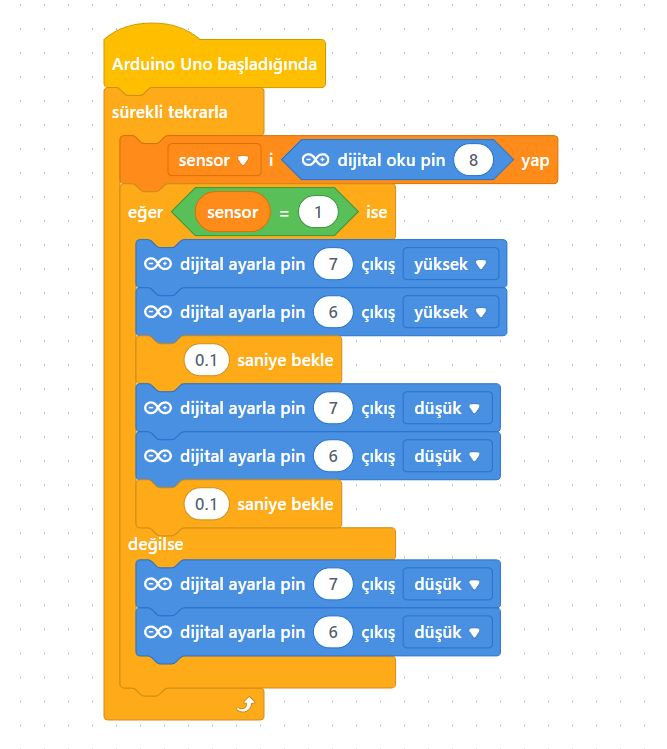
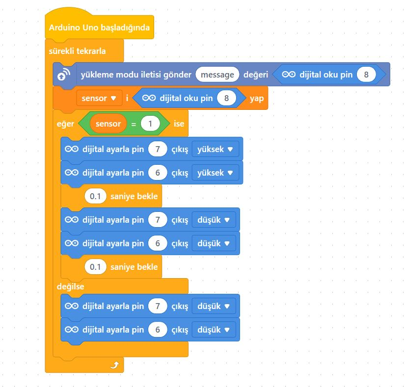
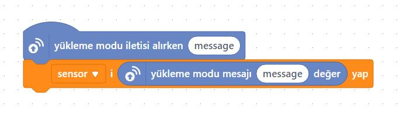

# Ders 16: HC-SR501 PIR (Hareket) Sensörü ile Hırsız Alarmı 🚨🏃‍♂️🔊

Evlerimizde veya apartman merdivenlerinde biz yürürken lambaların nasıl kendiliğinden yandığını ya da güvenlik alarmlarının hareketi nasıl algıladığını hiç düşündünüz mü? Robotist’in PIR Hareket Sensörlü Hırsız Alarmı uygulaması, çocukların çevredeki canlıların hareketlerini kızılötesi ışın değişimleriyle algılayıp kendi koruma sistemlerini yapmalarını sağlar.

Bu projeyle çocuklar; PIR (Passive Infrared) sensörün çalışma mantığını, hassasiyet ve zaman ayarlı trimpotları kullanmayı, dijital giriş-çıkış yönetimini ve canlı modda durum izlemeyi kavrar. Kendi güvenlik alarmını tasarlamak, onların kodlama ve otomasyon becerilerine büyük katkı sunar!

**Robotist ile keşfet, öğren, eğlen!**

---

## 🏃‍♂️ PIR (Hareket) Sensörü Nedir?

*   **PIR (Passive InfraRed):** Çevredeki sıcaklık yayan canlıların yaydığı görünmez kızılötesi (IR) enerjideki anlık değişimleri yakalayan hassas sensörlerdir.
*   **Ayar Trimpotları:** Sensör üzerinde iki adet ayarlı direnç bulunur:
    *   **Hassasiyet Ayarı (Sensitivity / SX):** Algılama mesafesini **3 metre ile 5 metre** arasında ayarlar.
    *   **Zaman Ayarı (Time / TX):** Hareket algılandıktan sonra çıkışın ne kadar süre boyunca HIGH (1) kalacağını (**5 saniye ile 200 saniye** arası) belirler.



---

## ⚙️ Gerekli Elemanlar

1. **Arduino Uno** (Zekamız)
2. **Breadboard** (Bağlantı tahtamız)
3. **1x HC-SR501 PIR Hareket Sensörü** (Kızılötesi gözümüz)
4. **1x Kırmızı LED** (Tehlike ışığımız)
5. **1x Buzzer** (Siren sesimiz)
6. **1x 220Ω Direnç** (LED koruması)
7. **Jumper Kablolar**

---

## 🔌 Devre Şeması

*   **PIR Sensörü:** Vcc ➡️ **5V**, Gnd ➡️ **GND**, Data (Out) ➡️ **Pin 8**
*   **LED:** Anot (+) ucu 220Ω direnç üzerinden **Pin 6**'ya, katot (-) ucu **GND**'ye bağlanır.
*   **Buzzer:** Artı (+) ucu **Pin 7**'ye, eksi (-) ucu **GND**'ye bağlanır.



---

## 🧩 mBlock Blok Kodları

Bu projeyi hem Arduino'ya yükleyerek (Normal Mod) hem de bilgisayar ekranındaki Panda kuklası ile konuşturarak (Canlı Mod) kodlayabiliriz.

### A) Yükleme Modu (Normal Mod) Blokları
Bu blok şeması, kodları doğrudan Arduino hafızasına yazar ve bilgisayardan bağımsız çalışmasını sağlar:



### B) Canlı Mod (Live Mode) Etkileşim Blokları
Donanım üzerinden okunan hareket durumunu eş zamanlı olarak ekrandaki Panda kuklasına aktararak konuşmasını sağlar:

*   **Aygıtlar (Arduino Uno) Blokları:**
    
*   **Kuklalar (Sprite/Panda) Blokları:**
    

---

## 💻 Arduino C/C++ Kodları

```cpp
/*
  Ders 16: HC-SR501 PIR (Hareket) Sensörü ile Hırsız Alarmı
*/

const int pirPin = 8;
const int ledPin = 6;
const int buzzerPin = 7;

int hareketDurumu = 0;

void setup() {
  Serial.begin(9600); // Hareket raporlarını ekrandan izlemek için
  pinMode(pirPin, INPUT);
  pinMode(ledPin, OUTPUT);
  pinMode(buzzerPin, OUTPUT);
}

void loop() {
  hareketDurumu = digitalRead(pirPin); // Hareketi oku (1 veya 0)
  
  if (hareketDurumu == HIGH) {
    Serial.println("HAREKET VAR! Siren çalıyor!");
    digitalWrite(ledPin, HIGH);
    
    // Siren sesi efekti
    digitalWrite(buzzerPin, HIGH);
    delay(100);
    digitalWrite(buzzerPin, LOW);
    delay(100);
  } else {
    Serial.println("Hareket yok, ortam güvenli.");
    digitalWrite(ledPin, LOW);
    digitalWrite(buzzerPin, LOW);
    delay(200);
  }
}
```

---

## 🌐 Tinkercad Simülasyonu

Projeyi bilgisayarınızda kurmadan çevrimiçi simüle etmek isterseniz:
👉 **[Tinkercad Devresini İncele](https://www.tinkercad.com/)**
