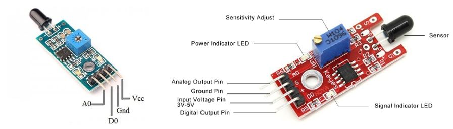
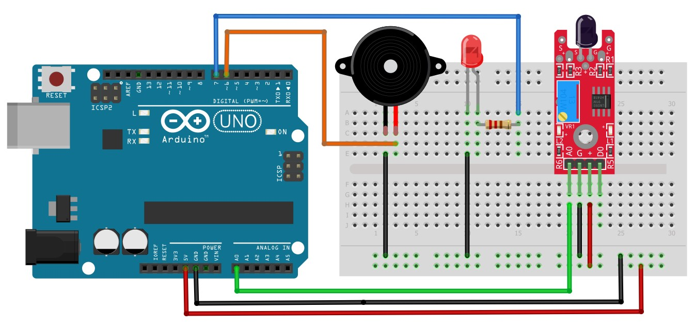
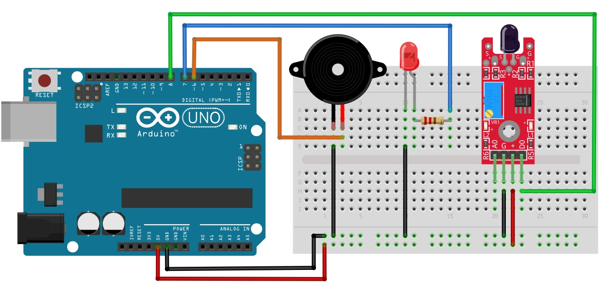
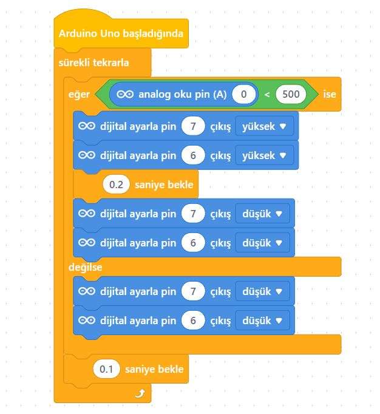
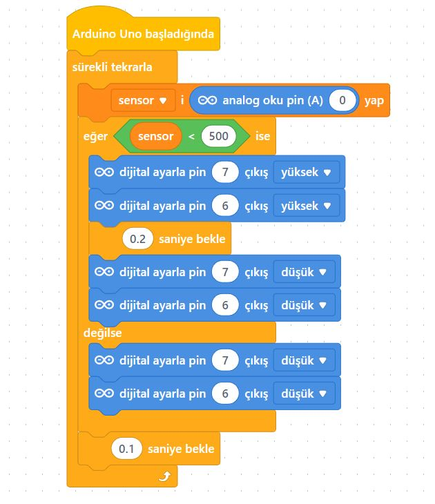
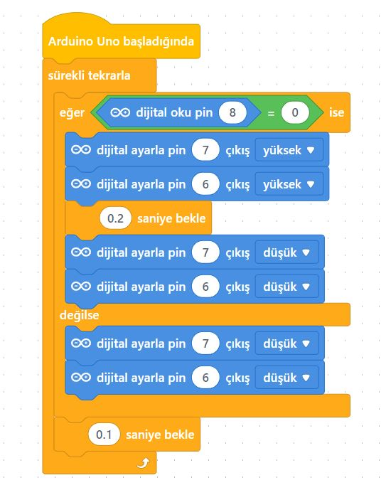
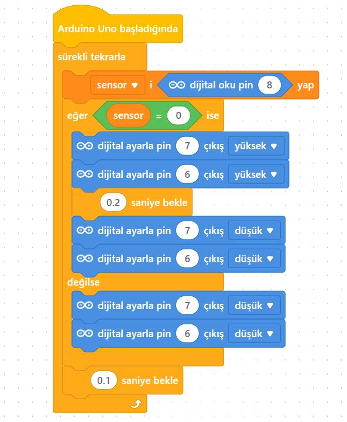

# Ders 17: LM393 Alev Sensörü ile Yangın Alarmı 🔥🚨🔊

Yangın söndürme sistemlerinin, akıllı ev alarmlarının veya yangın söndüren robotların yangın başlangıcını nasıl bu kadar hızlı algıladığını hiç merak ettiniz mi? Robotist’in Alev Sensörlü Yangın Alarmı uygulaması, çocukların alevin yaydığı kızılötesi ışığı (dalga boyunu) algılayan özel bir sensör yardımıyla kendi erken uyarı sistemlerini kurmalarını sağlar.

Bu projeyle çocuklar; kızılötesi (IR) dalga boyu algılama prensibini, analog ve dijital okuma modları arasındaki farkları, alev sensörünün ters lojik (ateş varken 0 çıkış verme) çalışma şeklini ve eşik değer (threshold) kalibrasyonunu kavrar. Kendi yangın koruma sistemini yapmak, onların problem çözme ve fen-teknoloji entegrasyonu becerilerini geliştirir!

**Robotist ile keşfet, öğren, eğlen!**

---

## 🔥 LM393 Alev Sensörü Nedir?

*   **Algılama Dalga Boyu:** Sensör, alevlerin ve ışık kaynaklarının yaydığı **760 nm ile 1100 nm** arasındaki kızılötesi ışınları algılayan bir IR alıcıya sahiptir.
*   **Algılama Açısı:** Yaklaşık 60 derecelik bir algılama açısına sahiptir.
*   **Hassasiyet Trimpotu:** Kart üzerindeki mavi potansiyometre (trimpot) çevrilerek algılama hassasiyeti ve dijital tetikleme noktası ayarlanır.
*   **Ters Lojik Mantığı (Önemli!):**
    *   Alev **algılandığında** dijital çıkış (D0) ➡️ **0 (LOW)** olur.
    *   Alev **yokken** dijital çıkış (D0) ➡️ **1 (HIGH)** olur.
    *   Analog çıkışta (A0) ise alev yaklaştıkça değer **düşer** (0'a yaklaşır).



---

## ⚙️ Gerekli Elemanlar

1. **Arduino Uno** (Zekamız)
2. **Breadboard** (Bağlantı tahtamız)
3. **1x LM393 Alev Sensörü** (Kızılötesi gözümüz)
4. **1x Kırmızı LED** (Tehlike ışığı)
5. **1x Buzzer** (Siren sesi)
6. **1x 220Ω Direnç** (LED koruması)
7. **Jumper Kablolar**

---

## 🔌 Devre Şeması

Projeyi iki farklı şekilde kurabiliriz:

### A) Analog Okuma Bağlantısı
Sensörün analog çıkışı Arduino'nun **A0** pinine bağlanır.

*   **Sensör:** Vcc (+) ➡️ **5V**, Gnd (G) ➡️ **GND**, Data (A0) ➡️ **A0**
*   **LED:** Direnç üzerinden **Pin 7**'ye, katot (-) ucu **GND**'ye bağlanır.
*   **Buzzer:** Artı (+) ucu **Pin 6**'ye, eksi (-) ucu **GND**'ye bağlanır.



### B) Dijital Okuma Bağlantısı
Sensörün dijital çıkışı Arduino'nun dijital **Pin 8**'ine bağlanır.

*   **Sensör:** Vcc (+) ➡️ **5V**, Gnd (G) ➡️ **GND**, Data (D0) ➡️ **Pin 8**
*   **LED:** Direnç üzerinden **Pin 7**'ye, katot (-) ucu **GND**'ye bağlanır.
*   **Buzzer:** Artı (+) ucu **Pin 6**'ye, eksi (-) ucu **GND**'ye bağlanır.



---

## 🧩 mBlock Blok Kodları

mBlock 5'te bu projeyi hem analog pinden hem de dijital pinden okuma yaparak tasarlayabiliriz:

### A) Analog Okuma Blokları (A0)
Analog pinden gelen veri eşik değerin altına düştüğünde alarm tetiklenir:

*   **Doğrudan Pin Okumalı:**
    
*   **Değişken Kullanarak:**
    

### B) Dijital Okuma Blokları (Pin 8)
Sensörün ters lojik yapısına uygun olarak dijital okuma `0` (LOW) olduğunda alarm tetiklenir:

*   **Doğrudan Pin Okumalı:**
    
*   **Değişken Kullanarak:**
    

---

## 💻 Arduino C/C++ Kodları

```cpp
/*
  Ders 17: LM393 Alev Sensörü ile Yangın Alarmı Devresi
*/

const bool analogModAktif = true; // Analog mod için true, Dijital mod için false

const int sensorAnalogPin = A0;
const int sensorDijitalPin = 8;
const int ledPin = 7;
const int buzzerPin = 6;

const int analogEsik = 500; // Analog hassasiyet eşiği

void setup() {
  Serial.begin(9600);
  pinMode(sensorDijitalPin, INPUT);
  pinMode(ledPin, OUTPUT);
  pinMode(buzzerPin, OUTPUT);
}

void loop() {
  bool yanginVar = false;
  
  if (analogModAktif) {
    int alevDegeri = analogRead(sensorAnalogPin);
    Serial.print("Analog Deger: ");
    Serial.println(alevDegeri);
    if (alevDegeri < analogEsik) yanginVar = true;
  } else {
    int dijitalDeger = digitalRead(sensorDijitalPin);
    Serial.print("Dijital Deger: ");
    Serial.println(dijitalDeger);
    if (dijitalDeger == LOW) yanginVar = true; // Ateş varken 0 (LOW) üretir
  }
  
  if (yanginVar) {
    Serial.println("YANGIN ALGILANDI!");
    digitalWrite(ledPin, HIGH);
    digitalWrite(buzzerPin, HIGH);
    delay(80);
    digitalWrite(buzzerPin, LOW);
    delay(80);
  } else {
    digitalWrite(ledPin, LOW);
    digitalWrite(buzzerPin, LOW);
    delay(200);
  }
}
```

---

## 🌐 Tinkercad Simülasyonu

Projeyi bilgisayarınızda kurmadan çevrimiçi simüle etmek isterseniz:
👉 **[Tinkercad Devresini İncele](https://www.tinkercad.com/)**
